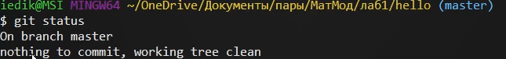
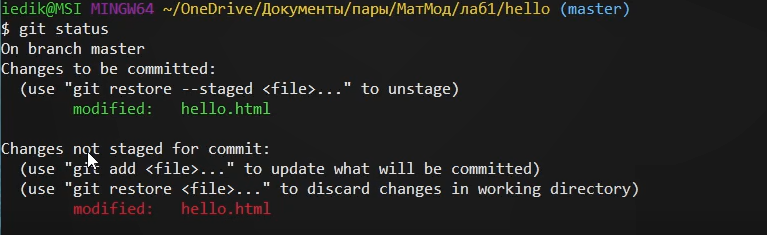
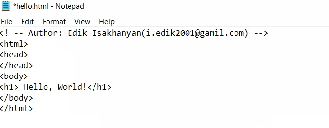
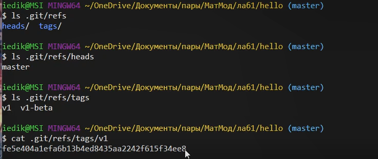
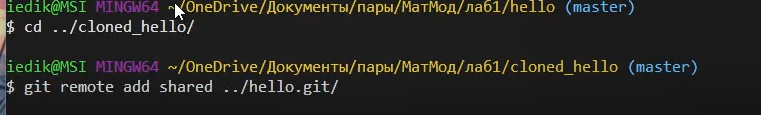

---
# Front matter
title: "Отчет по лабораторной работе №1"
subtitle: "Использование git"
author: "Исаханян Эдуард Тигранович"
group: NFIbd-01-19
institute: RUDN University, Moscow, Russian Federation
date: 2022 Feb 11th

# Generic otions
lang: ru-RU
toc-title: "Содержание"

# Bibliography
bibliography: bib/cite.bib
csl: pandoc/csl/gost-r-7-0-5-2008-numeric.csl

# Pdf output format
toc: true # Table of contents
toc_depth: 2
lof: true # List of figures
lot: true # List of tables
fontsize: 12pt
linestretch: 1.5
papersize: a4
documentclass: scrreprt
### Fonts
mainfont: PT Serif
romanfont: PT Serif
sansfont: PT Sans
monofont: PT Mono
mainfontoptions: Ligatures=TeX
romanfontoptions: Ligatures=TeX
sansfontoptions: Ligatures=TeX,Scale=MatchLowercase
monofontoptions: Scale=MatchLowercase,Scale=0.9
## Biblatex
biblatex: true
biblio-style: "gost-numeric"
biblatexoptions:
  - parentracker=true
  - backend=biber
  - hyperref=auto
  - language=auto
  - autolang=other*
  - citestyle=gost-numeric
## Misc options
indent: true
header-includes:
  - \linepenalty=10 # the penalty added to the badness of each line within a paragraph (no associated penalty node) Increasing the value makes tex try to have fewer lines in the paragraph.
  - \interlinepenalty=0 # value of the penalty (node) added after each line of a paragraph.
  - \hyphenpenalty=50 # the penalty for line breaking at an automatically inserted hyphen
  - \exhyphenpenalty=50 # the penalty for line breaking at an explicit hyphen
  - \binoppenalty=700 # the penalty for breaking a line at a binary operator
  - \relpenalty=500 # the penalty for breaking a line at a relation
  - \clubpenalty=150 # extra penalty for breaking after first line of a paragraph
  - \widowpenalty=150 # extra penalty for breaking before last line of a paragraph
  - \displaywidowpenalty=50 # extra penalty for breaking before last line before a display math
  - \brokenpenalty=100 # extra penalty for page breaking after a hyphenated line
  - \predisplaypenalty=10000 # penalty for breaking before a display
  - \postdisplaypenalty=0 # penalty for breaking after a display
  - \floatingpenalty = 20000 # penalty for splitting an insertion (can only be split footnote in standard LaTeX)
  - \raggedbottom # or \flushbottom
  - \usepackage{float} # keep figures where there are in the text
  - \floatplacement{figure}{H} # keep figures where there are in the text
---
# Цель работы  
Цель данной лабораторной работы является ознакомление с git.  

# Задание  
В ходе работы мы должны научится создавать проекты и изменять их. Также научится индексировать и удалять изменения, добавлять, удалять и изменять коммиты, перемещать файлы, создавать новые ветки и перемещаться по веткам, слиять, решать конфликты при слиянии и перебазировать ветки, клонировать репозитории, создавать чистые репозитории.

# Теоретическое введение
Описание основных команд git.

|Имя команды | описание команды                                |
|------------|-------------------------------------------------|
|git config  | Позволяет настроить значение конфигурации       |
|git init    | Создает новый проект                            |
|git status  | Показывает состояние репозитория                |
|git reset   | Убирает индексацию                              |
|git add     | Добавляет индексацию                            |
|git commit  | Фиксирует в коммите проиндексированные изменения|
|git log     | Показывает список коммитов                      |
|git tag     | Позволяет дать тег текущему состоянию на коммите|
|cat         | Показывает содержимое файла                     |
|git revert  | Отменяет новый коммит                           |
|git merge   | Сливает текущую ветку с указанным               |
|git clone   | Копирует репозиторий                            |
|git branch  | Создает новую ветку                             |
|git pull    | Загружает данные с внешнего репозитория         |

# Выполнение лабораторной работы

**1.Подготовка**		
	*1.1. установка имени и электронной почты*  
		Первое что нужно сделать это установить имя и электронную почту, для того чтобы git узнавал нас.  
		  
	*1.2. Установка окончаний строк*  
		Настраиваем core.autocrlf с параметрами true, чтобы сделать все переводы  
		строк текстовых файлов в главном репозитории одинаковы. Устанавливаем core.safecrlf в warn.  	
		  
	*1.3. Установка отображения unicode*  
		Git по умолчанию не печатает ASCII, и чтобы избежать нечитаемых строк, установим отображение unicode.  
		  

**2. Создание проекта**  
	*2.1. Создание страницу "Hello,World!"**  
		Для начала создаем пустой каталог с именем hello, затем заходим в него и создаем там файл с именем hello.html.  
		  
		  
	*2.2. Создание репозитория*  
		Чтобы создать git репозиторий из этого каталога, нужно выполнить команду git init.  
		  
	*2.3. Добавление файла в репозиторий*  
		Добавим файл в репозиторий.  
		  
	*2.4. Проверка состояние репозитория*  
		Используем команду git status, чтобы проверить текущее состояние репозитория.  
		   
		И мы видим, что коммитить нечего. Это означает, что в репозитории хранится текущее состояние рабочего каталога, и нет никаких
		изменений, ожидающих записи.  

**3. Внесение изменений**  
	*3.1 Изменение  страницы «Hello, World»*  
	Добавим кое-какие HTML-теги к нашему приветствию.  
	  

**4. Индексация изменений**  
	*4.1. Индексация*  
		Индексируем изменения и проверим статус.  
		  
		Мы видим, что git знает об изменениях, но изменение пока не записано в репозиторий.  
	*4.2. Коммит*  
		Сделаем коммит без -m, откроется редактор и там напишем «Added h1 tag».  
		  
*4.3. Добавить стандартные теги страницы*  
	Изменим страницу «Hello, World», чтобы она содержала стандартные теги < html> и < body>.  
	  
	Теперь добавим это изменение в индекс git.  
	  
	Добавим заголовки HTML (секцию < head>) к странице «Hello, World».  
	  
	Проверим текущий статус.  
	  
	Видим, что hello.html указан дважды в состоянии. Первое изменение (добавление стандартных тегов) проиндексировано и готово к коммиту. Второе изменение (добавление заголовков HTML) является не проиндексированным. Если бы мы делали коммит сейчас, заголовки не были бы сохранены в репозиторий.    
	Произведем коммит проиндексированного изменения, а затем еще раз проверим состояние.  
	  
	    
	Состояние команды говорит нам о том, что hello.html имеет незафиксированные изменения, но уже не в буферной зоне.  
	Теперь добавим второе изменение в индекс, а затем сделаем коммит.  
	    
	В качестве файла для добавления, мы использовали текущий каталог ().. Это 
	краткий и удобный путь для добавления всех изменений в файлы текущего каталога
	и его подкаталоги.  
*4.4. История*  
	Получим список произведенных изменений.  
	  
*4.5. Получение старых версий*
Изучим данные лога и найдем хэш для первого коммита. Он должен быть в
последней строке данных. Используем этот хэш-код, чтобы вернуть состояние к начальному.  
  
Проверим, что мы вернулись назад.  
  
Вернемся к последней версии через master и проверим это.
  
*4.6. Создание тегов версий*  
Назовем текущую версию страницы hello v1.  
  
Теперь текущая версия страницы называется v1.  
Создадим тег для версии, которая идет
перед текущей версией и назовем его v1-beta. В первую очередь нам надо переключиться на предыдущую версию. Вместо поиска до хэш, мы будем использовать
^, обозначающее «родитель v1».  
  
  
*4.7 Просмотр тегов*  
Мы можем посмотреть теги в логе.  
   
Мы видим теги (v1 и v1-beta) в логе вместе с именем ветки (master).
Кроме того, HEAD показывает коммит, на который мы переключились.  

**5. Отмена локальных изменений**  
*5.1. Изменим hello.html*  
Иногда случается, что мы изменили файл в рабочем каталоге, и хотим отменить
последние коммиты. С этим справится команда git checkout.
Добавим в hello.html нежелательный комментарий.  
   
*5.2. Отмена изменений в рабочем каталоге*  
Используем команду git checkout для переключения версии файла
hello.html в репозитории.  
  

**6. Отмена проиндексированных изменений**   
Добавим в hello.html нежелательный комментарий.  
  
Проиндексируем это изменение и отменим индексацию.  
  
Команда git reset сбрасывает буферную зону к HEAD. Это очищает буферную
зону от изменений, которые мы только что проиндексировали.
Команда git reset (по умолчанию) не изменяет рабочий каталог. Поэтому
рабочий каталог все еще содержит нежелательный комментарий. Мы можем использовать команду git checkout, чтобы удалить нежелательные изменения в
рабочем каталоге.  
  
Наш рабочий каталог опять чист.  

**7. Отмена коммитов**  
  
  
Чтобы отменить коммит, нам необходимо сделать коммит, который удаляет изменения, сохраненные нежелательным коммитом.  
  
Перейдем в редактор, где мы можем отредактировать коммит-сообщение по
умолчанию или оставить все как есть.  
  
Посмотрим, что у нас в логе.  
  
Проверка лога показывает нежелательные и отмененные коммиты в наш репозиторий.  

**8. Удаление коммитов из ветки**  
Отметим тегом это состояние и сбросим коммит к предшествующим коммиту Oops.    
    
Проверим  удалили ли мы этот коммит.  
  
Но если мы посмотрим на все коммиты, то увидим, что ошибочный коммит не исчез.  
  
Давайте удалим этот коммит с помощью тега.  
  
Проверим исчезли ли коммиты.  
  

**9. Внесение изменений в коммиты**  
Изменим страницу добавим имя и фамилию.   
  
Проиндексируем и сделаем коммит.  
  
Теперь добавим электронную почту.  
  
Мы не хотим создавать отдельный коммит только ради электронной
почты. Поэтому изменим предыдущий коммит, включив в него адрес электронной
почты.   
  
Посмотрим изменился ли наш коммит.  
  

**10. Перемещение файлов**  
Давайте создадим новый каталог и перенесем страницу в каталог lib. Затем сделаем коммит этого перемещения.  
  
И добавим новый файл под именем index.html.  
  
  

**11. Каталог .git**  
Посмотрим содержимое каталога .git и посмотрим базу данных объектов, мы увидим имена которых состоят из 2 символов. Это имена каталогов являются первыми двумя буквами хэша.  
  
Также посмотрим на какой-нибудь хэш в данных объектов и настройки конфигурации.  
  
посмотрим на содержимое веток и тегов.  
  
Также посмотрим на содержимое HEAD.  
  
Мы видим, что содержимое HEAD это ссылка на текущую ветку, в данный момент это ветка master.  

**12. Работа непосредственно с объектами git**  
Посмотрим на наш последний коммит.  
  
Посмотрим на данные последнего коммита.  
  
посмотрим на данные дерево.  
  
Затем посмотрим на данные каталога lib.  
  
И посмотрим на что хранится в hello.html.  
  

**13. Создание ветки**  
Давайте создадим новую ветку и назовём «style».  
  
Добавим файл стилей style.css.  
  
  
Обновим файл hello.html, чтобы использовать стили style.css.  
  
  
Обновим файл index.html, чтобы он тоже использовал style.css.  
  
   

**14. Навигация по веткам**  
Посмотрим на наши ветки.  
  
Вернемся на ветку master и проверим, что мы на ветке master.  
  
Вернемся на ветку style и проверим это.  
  

**15. Изменения в ветке master**  
Создадим файл README в ветке master.  
  
  
Теперь у нас в репозитории есть две отличающиеся ветки. Используем лог-команду для просмотра веток и их отличий.  
  

**16. Слияние**  
Слияние переносит изменения из двух веток в одну. Давайте вернемся к ветке
style и сольем master с style.  
  
  
Путем периодического слияния ветки master с веткой style мы можем переносить из master любые изменения и поддерживать совместимость изменений
style с изменениями в основной ветке.  
Теперь попробуем создать конфликт. Для этого в ветке master зайдем в файл hello.html и немного изменим его.  
  
  
  
После попытки слить master с style наш файл hello.html изменился, и чтобы решить этот конфликт нужно вручную изменить файл.  
  
  
  
И сделаем коммит решения конфликта.  
  

**17. Сброс веток**  
Перейдем на ветку style к точке перед тем, как мы слили ее с веткой master. Для этого, посмотрим на лог
и скопируем хэш до слияния, после сбросим ветку style до этого момента.  
  
  
  
Теперь пойдем на ветку master в точку перед внесением конфликтующих изменений.  
  
   

**18. Перебазирование**  
Мы вернулись в точку до первого слияния и хотим перенести изменения из ветки master в нашу ветку style.  
  
Мы видим, что перебазирование очень похоже на слияние, однако дерево коммитов ветки style было переписано таким образом, что ветка master является
частью истории коммитов. 
  

**19. Слияние в ветку master**  
После преобразования, давайте сольем изменения style в ветку master.  
  
Поскольку последний коммит ветки master прямо предшествует последнему
коммиту ветки style, git выполняет ускоренное слияние-перемотку.  
Теперь ветки style и master идентичны.  
  

**20. Клонирование репозиториев**  
Перейдем в рабочий каталог и сделаем клон вашего репозитория hello.  
  
  
Мы видим,что в клонированном репозитории все файлы из оригинального репозитория.  
Теперь посмотрим на историю репозитория.  
  
Мы видим список всех коммитов в новый репозиторий, и он совпадает с историей коммитов в оригинальном репозитории. 
Единственная разница в названиях веток.  
  
Мы видим, что клонированный репозиторий знает об имени по умолчанию
удаленного репозитория.  

**21. Удаленные ветки**  
Давайте посмотрим на ветки, доступные в нашем клонированном репозитории.  
  
Как мы видим, в списке только ветка master. Команда git
branch выводит только список локальных веток по умолчанию. Но используя команду git branch -a мы видим все ветки.  

**22. Изменение оригинального репозитория**  
Вернемся к оригинальному репозиторию.  
  
Создадим файл README.md.  
  
  
Извлечем изменения из удаленного репозитория.  
  
  
Проверим что находится в клонированном README, сольем извлеченные изменения и проверим.  
  
Вместо двух команд git fetch и git merge origin/master мы могли бы просто сделать git pull.  
  

**23. Добавление ветки наблюдения**  
Ветки, которые начинаются с remotes/origin являются ветками оригинального
репозитория. У нас больше нет ветки под названием style,
но система контроля версий знает, что в оригинальном репозитории ветка style
была. Поэтому добавим локальную ветку, которая отслеживает удаленную ветку.  
  
  

**24. Чистые репозитории**  
Чистые репозитории (без рабочих каталогов) обычно используются для расшаривания. Обычный git-репозиторий подразумевает, что мы будем использовать
его как рабочую директорию, поэтому вместе с файлами проекта в актуальной
версии, git хранит все служебные, «чисто-репозиториевские» файлы в поддиректории .git. В удаленных репозиториях нет смысла хранить рабочие файлы на диске
(как это делается в рабочих копиях), а все что им действительно нужно — это дельты изменений и другие бинарные данные репозитория.  
  
Как правило, репозитории, оканчивающиеся на .git являются чистыми репозиториями. Мы видим, что в репозитории hello.git нет рабочего каталога. По сути,
это есть не что иное, как каталог .git нечистого репозитория.

**25. Добавление удаленного репозитория**  
Давайте добавим репозиторий hello.git к нашему оригинальному репозиторию.  
  

**26. Отправка изменений**  
Так как чистые репозитории, как правило, расшариваются на каком-нибудь сетевом сервере, нам необходимо отправить наши изменения в другие репозитории.  
  
  
  
  

**26. Извлечение общих изменений**  
Переключимся в клонированный репозиторий и извлечем изменения, только что отправленные в общий репозиторий.  
  
  

# Выводы
Входе работы, мы научились использовать git, изучили основы работы с git репозиториями.

# Список литературы{.unnumbered}

::: {#refs}
:::