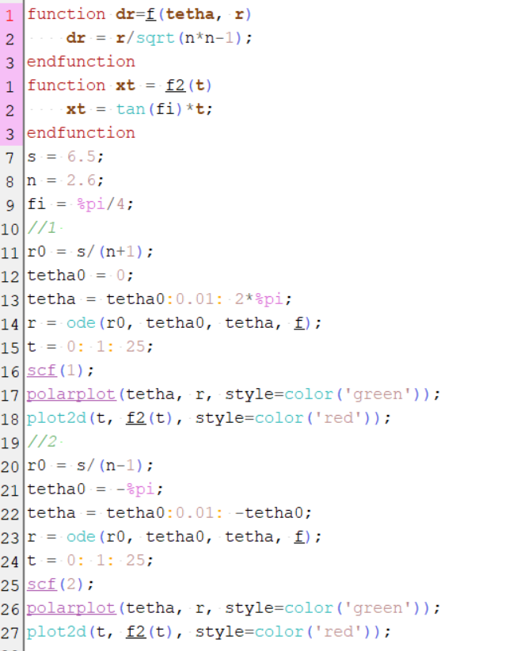
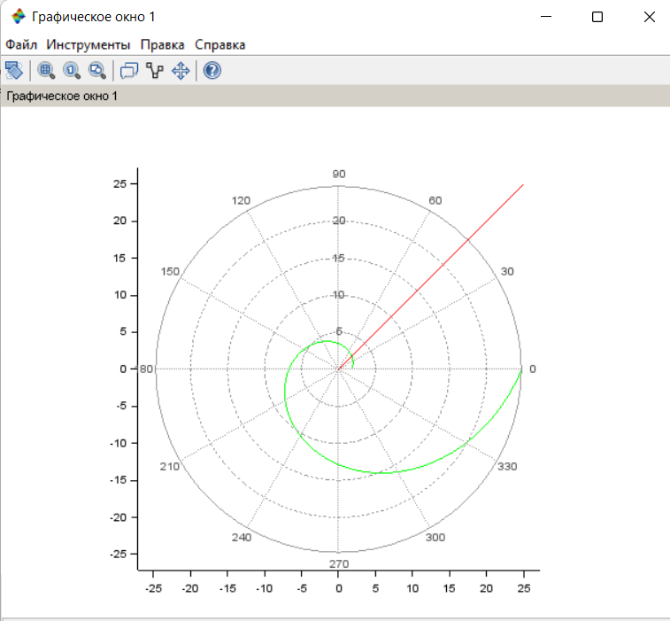
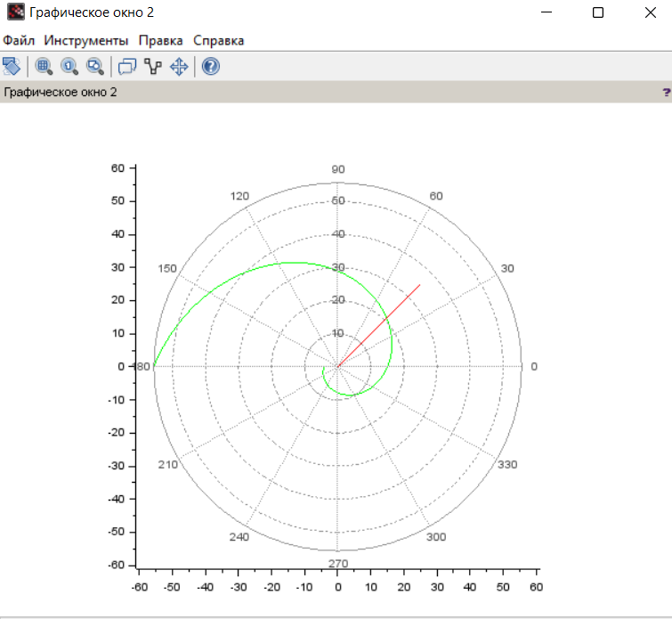

---
# Front matter
lang: ru-RU
title: Защита лабораторной работы №2. Задача о погоне
author: "Исаханян Эдуард Тигранович"
group: NFIbd-01-19
institute: RUDN University, Moscow, Russian Federation
date: 2022 Feb 18th

# Formatting
toc: false
slide_level: 2
theme: metropolis
header-includes: 
 - \metroset{progressbar=frametitle,sectionpage=progressbar,numbering=fraction}
 - '\makeatletter'
 - '\beamer@ignorenonframefalse'
 - '\makeatother'
aspectratio: 43
section-titles: true

---

# Защита лабораторной работы №1  

# Прагматика выполнения лабораторной работы  
Данная лабораторная работа выполнялась для получения знаний в области математического моделирования и решения задач о погоне.  

# Цель  
Цель данной лабораторной работы построения математической модели для
решения задачи о погоне.  

# Задачи  

1. Записать уравнение, описывающее движение катера, с начальными
   условиями для двух случаев.  
2. Построить траекторию движения катера и лодки для двух случаев.  
3. Определить точку пересечения траектории катера и лодки с помощью графиков.  

# Уравнения  

$$ \left\{
\begin{array}{c}
\frac{dt}{dt} = v \\
r\frac{d\theta}{dt} = \sqrt(5.76)v \\
\end{array}
\right.$$
с начальными условиями  
$$ \left\{
\begin{array}{c}
\theta = 0 \\
r = \frac{k}{3.6} \\
\end{array}
\right.$$
или  
$$ \left\{
\begin{array}{c}
\theta = -\pi \\
r = \frac{k}{1.6} \\
\end{array}
\right.$$  

# Код  

  

# Результат выполнения  

  

# Результат выполнения  

  

# Вывод   

1. Записали уравнение, описывающее движение катера, с начальными
   условиями для двух случаев.  
2. Построили траекторию движения катера и лодки для двух случаев.  
3. Определили точку пересечения траектории катера и лодки с помощью графиков.  

