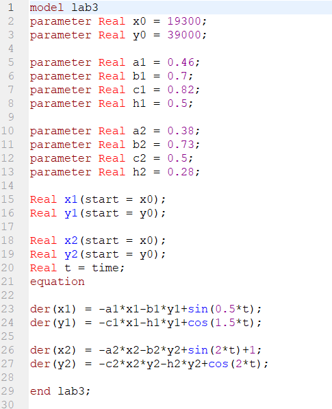
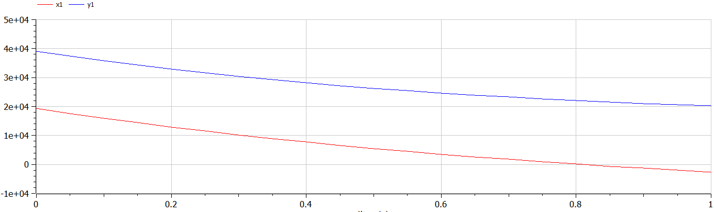
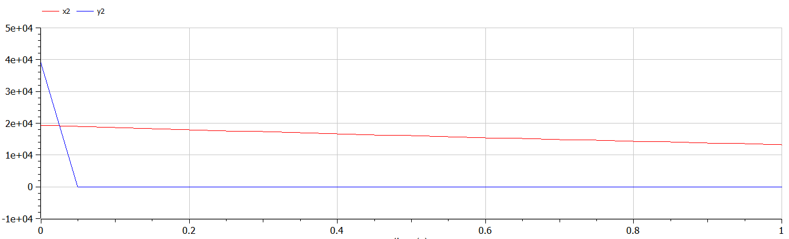

---
# Front matter
lang: ru-RU
title: Защита лабораторной работы №3. Модель боевых действий
author: "Исаханян Эдуард Тигранович"
group: NFIbd-01-19
institute: RUDN University, Moscow, Russian Federation
date: 2022 Feb 24th

# Formatting
toc: false
slide_level: 2
theme: metropolis
header-includes:
- \metroset{progressbar=frametitle,sectionpage=progressbar,numbering=fraction}
- '\makeatletter'
- '\beamer@ignorenonframefalse'
- '\makeatother'
  aspectratio: 43
  section-titles: true

---

# Защита лабораторной работы №1

# Цель
Цель данной лабораторной работы научиться решать задачу о ведении
боевых действий с помощью математического моделирования.  

# Задачи

1. Рассмотреть 2 случая:
    - Модель боевых действий между регулярными войсками;
    - Модель ведение боевых действий с участием регулярных войск и
      партизанских отрядов.
2. Построить графики x(t) и y(t).  

# Уравнения  

Модель боевых действий между регулярными войсками:  
$\frac{dx}{dt} = -a(t)x(t)-b(t)y(t)+P(t)$  
$\frac{dy}{dt} = -c(t)x(t)-h(t)y(t)+Q(t)$   
Модель ведение боевых действий с участием регулярных войск и партизанских отрядов:  
$\frac{dx}{dt} = -a(t)x(t)-b(t)y(t)+P(t)$  
$\frac{dy}{dt} = -c(t)x(t)y(t)-h(t)y(t)+Q(t)$  
# Код

# Результат выполнения

# Результат выполнения

# Вывод

1. Рассмотрели 2 случая;
2. Построили графики x(t) и y(t).
