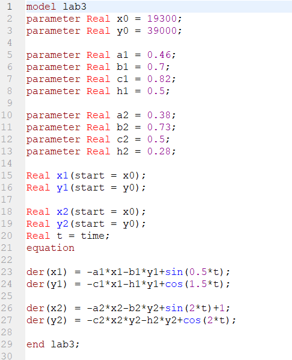
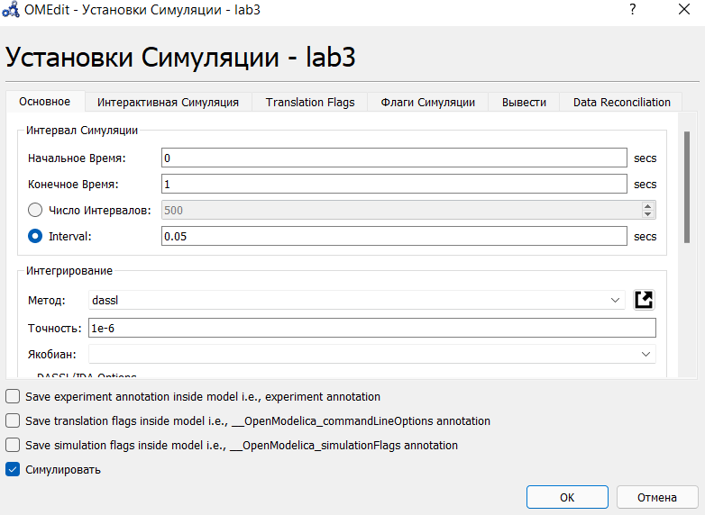
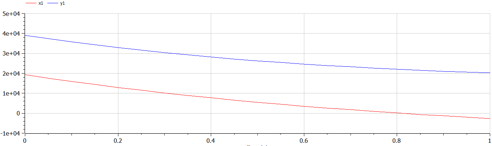
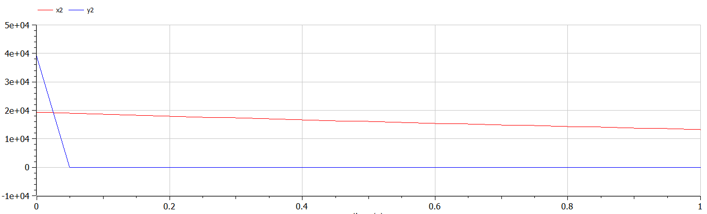

---
# Front matter
title: "Отчет по лабораторной работе №3"
subtitle: "Модель боевых действий "
author: "Исаханян Эдуард Тигранович"
group: NFIbd-01-19
institute: RUDN University, Moscow, Russian Federation
date: 2022 Feb 24th

# Generic otions
lang: ru-RU
toc-title: "Содержание"

# Bibliography
bibliography: bib/cite.bib
csl: pandoc/csl/gost-r-7-0-5-2008-numeric.csl

# Pdf output format
toc: true # Table of contents
toc_depth: 2
lof: true # List of figures
lot: true # List of tables
fontsize: 12pt
linestretch: 1.5
papersize: a4
documentclass: scrreprt
### Fonts
mainfont: PT Serif
romanfont: PT Serif
sansfont: PT Sans
monofont: PT Mono
mainfontoptions: Ligatures=TeX
romanfontoptions: Ligatures=TeX
sansfontoptions: Ligatures=TeX,Scale=MatchLowercase
monofontoptions: Scale=MatchLowercase,Scale=0.9
## Biblatex
biblatex: true
biblio-style: "gost-numeric"
biblatexoptions:
- parentracker=true
- backend=biber
- hyperref=auto
- language=auto
- autolang=other*
- citestyle=gost-numeric
## Misc options
indent: true
header-includes:
- \linepenalty=10 # the penalty added to the badness of each line within a paragraph (no associated penalty node) Increasing the value makes tex try to have fewer lines in the paragraph.
- \interlinepenalty=0 # value of the penalty (node) added after each line of a paragraph.
- \hyphenpenalty=50 # the penalty for line breaking at an automatically inserted hyphen
- \exhyphenpenalty=50 # the penalty for line breaking at an explicit hyphen
- \binoppenalty=700 # the penalty for breaking a line at a binary operator
- \relpenalty=500 # the penalty for breaking a line at a relation
- \clubpenalty=150 # extra penalty for breaking after first line of a paragraph
- \widowpenalty=150 # extra penalty for breaking before last line of a paragraph
- \displaywidowpenalty=50 # extra penalty for breaking before last line before a display math
- \brokenpenalty=100 # extra penalty for page breaking after a hyphenated line
- \predisplaypenalty=10000 # penalty for breaking before a display
- \postdisplaypenalty=0 # penalty for breaking after a display
- \floatingpenalty = 20000 # penalty for splitting an insertion (can only be split footnote in standard LaTeX)
- \raggedbottom # or \flushbottom
- \usepackage{float} # keep figures where there are in the text
- \floatplacement{figure}{H} # keep figures where there are in the text
---

# Цель работы  

Цель данной лабораторной работы научиться решать задачу о ведении боевых действий с помощью математического моделирования.  

# Задание  

В ходе работы мы должны:  

1. Рассмотреть 2 случая:  
   - Модель боевых действий между регулярными войсками;  
   - Модель ведение боевых действий с участием регулярных войск и
     партизанских отрядов.  
2. Построить графики x(t) и y(t).  

# Теоретическое введение
Рассмотрим некоторые простейшие модели боевых действий – модели
Ланчестера. В противоборстве могут принимать участие как регулярные войска,
так и партизанские отряды. В общем случае главной характеристикой соперников
являются численности сторон. Если в какой-то момент времени одна из
численностей обращается в нуль, то данная сторона считается проигравшей (при
условии, что численность другой стороны в данный момент положительна).
Рассмотри два случая ведения боевых действий:
1. Боевые действия между регулярными войсками;
2. Боевые действия с участием регулярных войск и партизанских
   отрядов.  
В первом случае численность регулярных войск определяется тремя
факторами:
   - скорость уменьшения численности войск из-за причин, не связанных с
   боевыми действиями (болезни, травмы, дезертирство);
   - скорость потерь, обусловленных боевыми действиями
   противоборствующих сторон (что связанно с качеством стратегии,
   уровнем вооружения, профессионализмом солдат и т.п.);
   - скорость поступления подкрепления (задаётся некоторой функцией от
   времени).  
В этом случае модель боевых действий между регулярными войсками
описывается следующим образом:  
$\frac{dx}{dt} = -a(t)x(t)-b(t)y(t)+P(t)$  
$\frac{dy}{dt} = -c(t)x(t)-h(t)y(t)+Q(t)$  
Потери, не связанные с боевыми действиями, описывают члены -a(t)x(t) и 
-h(t)y(t), члены -b(t)y(t) и -c(t)x(t) отражают потери на поле боя.  
Коэффициенты b(t) и c(t) указывают на эффективность боевых действий со
стороны y и x соответственно, a(t),h(t) - величины, характеризующие степень
влияния различных факторов на потери. Функции P(t), Q(t) учитывают
возможность подхода подкрепления к войскам X и Y в течение одного дня.  
Во втором случае в борьбу добавляются партизанские отряды. Нерегулярные
войска в отличии от постоянной армии менее уязвимы, так как действуют скрытно,
в этом случае сопернику приходится действовать неизбирательно, по площадям,
занимаемым партизанами. Поэтому считается, что тем потерь партизан,
проводящих свои операции в разных местах на некоторой известной территории,
пропорционален не только численности армейских соединений, но и численности
самих партизан. В результате модель принимает вид:  
$\frac{dx}{dt} = -a(t)x(t)-b(t)y(t)+P(t)$  
$\frac{dy}{dt} = -c(t)x(t)y(t)-h(t)y(t)+Q(t)$  
В этой системе все величины имею тот же смысл, что и в первой системе.

# Выполнение лабораторной работы  
1. Напишем программу для построения модели боевых действий для обоих случая.  
  
2. Поставим параметры симуляции от 0 до 1 с шагом 0.05.  
  
3. Выведем графики для первого случая.  
  
4. Выведем графики для второго случая.  
  

# Выводы  

В ходе работы, мы научились строить модель боевых действий между регулярными войсками и модель ведение боевых действий с участием партизанских отрядов.  

# Список литературы{.unnumbered}  
1. Методические материалы к лабораторной работе, представленные на сайте "ТУИС РУДН" https://esystem.rudn.ru/  
   ::: {#refs}
   :::