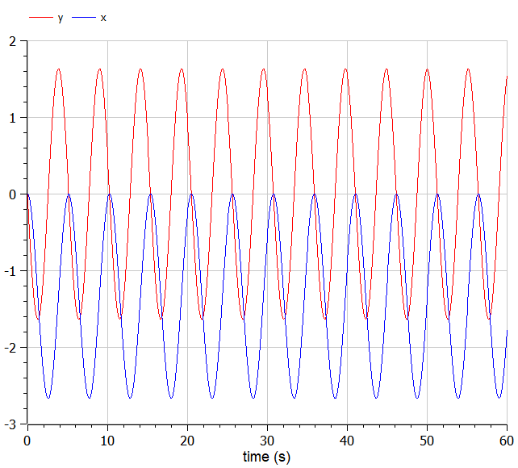
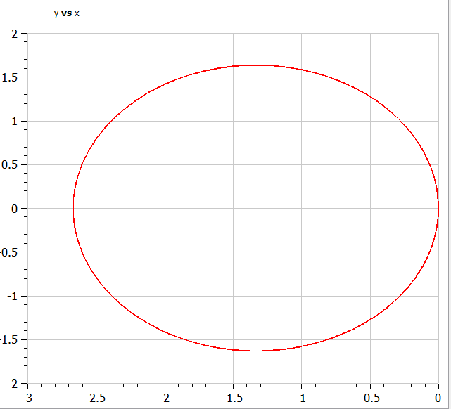
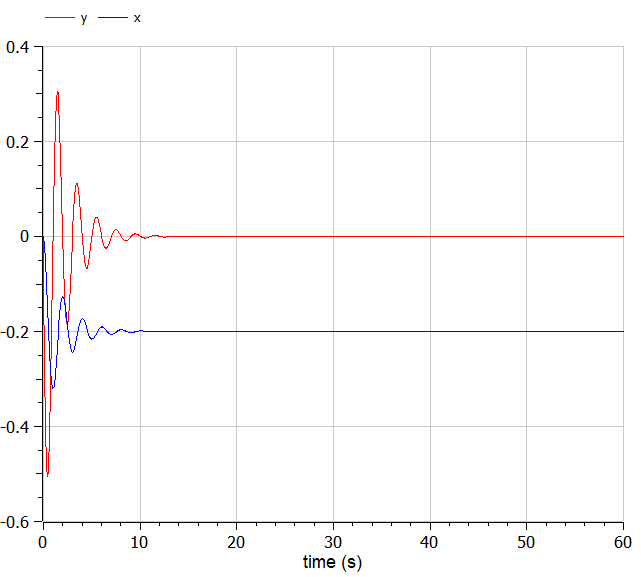
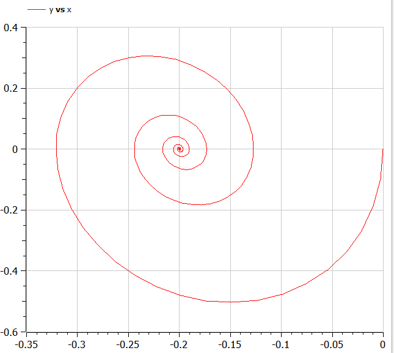
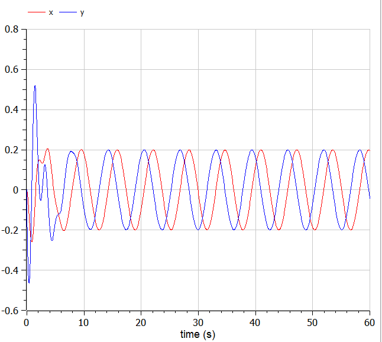
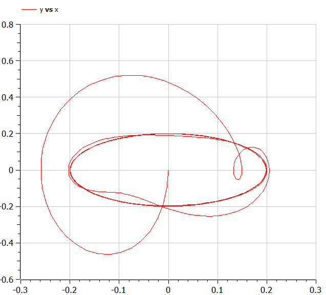

---
# Front matter
lang: ru-RU
title: Защита лабораторной работы №4. Модель гармонических колебаний
author: "Исаханян Эдуард Тигранович"
group: NFIbd-01-19
institute: RUDN University, Moscow, Russian Federation
date: 2022 Feb 26th

# Formatting
toc: false
slide_level: 2
theme: metropolis
header-includes:
  - \metroset{progressbar=frametitle,sectionpage=progressbar,numbering=fraction}
  - '\makeatletter'
  - '\beamer@ignorenonframefalse'
  - '\makeatother' 
aspectratio: 43 
section-titles: true
---

# Защита лабораторной работы  

# Цель

Цель данной лабораторной работы научиться строить модели гармонических колебаний на примере линейного гармонического осциллятора.  

# Задачи

Построить фазовый портрет гармонического осциллятора и решение уравнения гармонического осциллятора для следующих случаев  

1. Колебания гармонического осциллятора без затуханий и без действий внешней силы $\ddot {x} + 1.5x = 0$
2. Колебания гармонического осциллятора c затуханием и без действий внешней силы $\ddot {x} + \dot {x} + 10x = 0$
3. Колебания гармонического осциллятора c затуханием и под действием внешней силы $\ddot {x} + \dot {x} + 11x = 2sin(t)$  
   На интервале $t \in [0; 60]$(шаг 0.05) с начальными условиями $x_0 = 0, y_0 = 0$  
 

# Уравнения  

Уравнение свободных колебаний гармонического осциллятора имеет
следующий вид:  
$$ \ddot {x} + 2 \gamma \dot {x} + w_0^2x = f(t) $$  
При отсутствии потерь в системе получаем уравнение консервативного осциллятора, энергия колебания которого сохраняется во времени:
$$ \ddot {x} + w_0^2x = 0 $$
Для однозначной разрешимости уравнения второго порядка необходимо задать два начальных условия вида:
$$ \left\{ \begin{array}{c} x(t_0) = x_0 \\ \dot{x}(t_0) = y_0 \end{array} \right. $$  

# Уравнения  

Уравнение второго порядка можно представить в виде системы двух уравнений первого порядка:
$$ \left\{ \begin{array}{c} \dot{x} = y \\ \dot{y} = -w_0^2x \end{array} \right.$$  
Начальные условия для системы примут вид:
$$ \left\{ \begin{array}{c} x(t_0) = x_0 \\ y(t_0) = y_0 \end{array} \right.$$  

# Результат выполнения

  

# Результат выполнения

  

# Результат выполнения

# Результат выполнения

  

# Результат выполнения

# Результат выполнения

# Вывод  

Построили фазовый портрет гармонического осциллятора и решили уравнения гармонического осциллятора для следующих случаев:

1. Колебания гармонического осциллятора без затуханий и без действий внешней силы $\ddot {x} + 1.5x = 0$
2. Колебания гармонического осциллятора c затуханием и без действий внешней силы $\ddot {x} + \dot {x} + 10x = 0$
3. Колебания гармонического осциллятора c затуханием и под действием внешней силы $\ddot {x} + \dot {x} + 11x = 2sin(t)$  
   На интервале $t \in [0; 60]$(шаг 0.05) с начальными условиями $x_0 = 0, y_0 = 0$  
 
