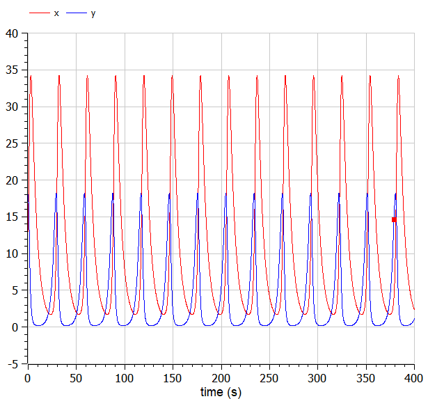
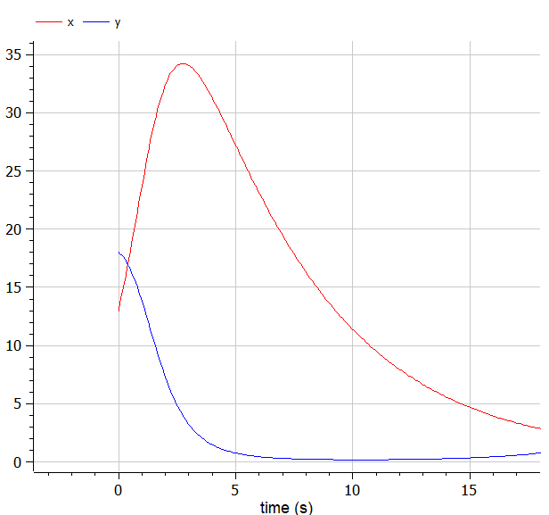
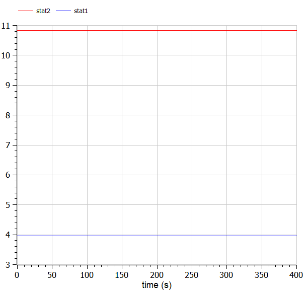

---
# Front matter
lang: ru-RU
title: Защита лабораторной работы №5. Модель «хищник-жертва»
author: "Исаханян Эдуард Тигранович"
group: NFIbd-01-19
institute: RUDN University, Moscow, Russian Federation
date: 2022 Feb 26th

# Formatting
toc: false
slide_level: 2
theme: metropolis
header-includes:
  - \metroset{progressbar=frametitle,sectionpage=progressbar,numbering=fraction}
  - '\makeatletter'
  - '\beamer@ignorenonframefalse'
  - '\makeatother' 
aspectratio: 43 
section-titles: true
---

# Защита лабораторной работы  

# Цель

Цель данной лабораторной работы научиться строить модели «хищник-жертва» на примере модели Лотки-Вольтерры.  

# Задачи

- Построить график зависимости численности хищников от численности жертв, а также графики изменения численности хищников и численности жертв;  
- Найти стационарное состояние системы.  

# Уравнение  

$$
\left\{
\begin{array}{c}
\frac{dx}{dt} = ax(t)+bx(t)y(t)
\\
\frac{dy}{dt} = -cy(t)-dx(t)y(t)
\end{array}
\right.
$$

# Результат выполнения

  

# Результат выполнения

  

# Результат выполнения

  

# Вывод  

- Познакомились с моделью «хищник-жертва» на примере простейшей модели взаимодействия - модели Лотки-Вольтерры.
- Построили график зависимости $x$ от $y$ и графики функций $x(t), y(t)$ и нашли стационарное состояние.
