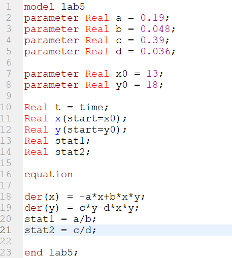
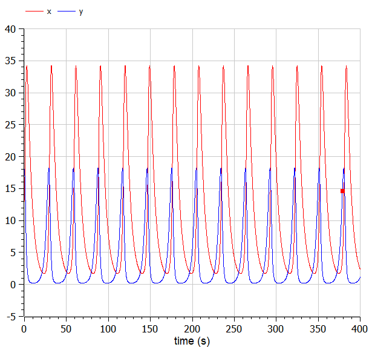
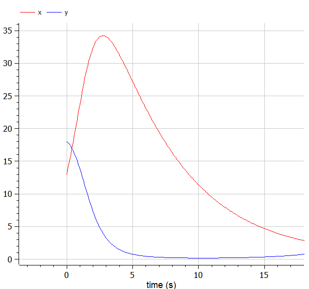
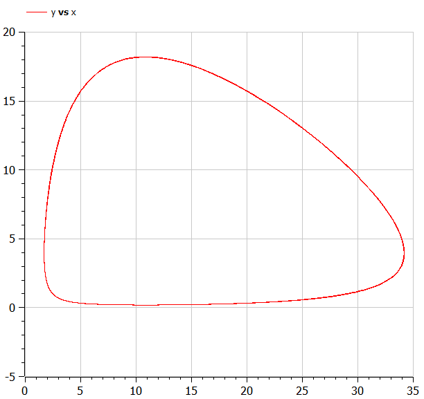
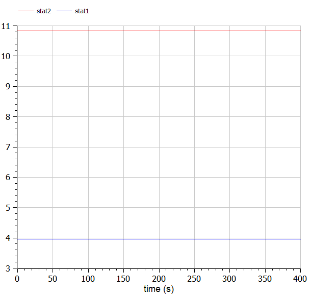

---
# Front matter
title: "Отчет по лабораторной работе №5"
subtitle: "Модель «хищник-жертва»"
author: "Исаханян Эдуард Тигранович"
group: NFIbd-01-19
institute: RUDN University, Moscow, Russian Federation
date: 2022 Feb 26th

# Generic otions
lang: ru-RU
toc-title: "Содержание"

# Bibliography
bibliography: bib/cite.bib
csl: pandoc/csl/gost-r-7-0-5-2008-numeric.csl

# Pdf output format
toc: true # Table of contents
toc_depth: 2
lof: true # List of figures
lot: true # List of tables
fontsize: 12pt
linestretch: 1.5
papersize: a4
documentclass: scrreprt
### Fonts
mainfont: PT Serif
romanfont: PT Serif
sansfont: PT Sans
monofont: PT Mono
mainfontoptions: Ligatures=TeX
romanfontoptions: Ligatures=TeX
sansfontoptions: Ligatures=TeX,Scale=MatchLowercase
monofontoptions: Scale=MatchLowercase,Scale=0.9
## Biblatex
biblatex: true
biblio-style: "gost-numeric"
biblatexoptions:
- parentracker=true
- backend=biber
- hyperref=auto
- language=auto
- autolang=other*
- citestyle=gost-numeric
## Misc options
indent: true
header-includes:
- \linepenalty=10 # the penalty added to the badness of each line within a paragraph (no associated penalty node) Increasing the value makes tex try to have fewer lines in the paragraph.
- \interlinepenalty=0 # value of the penalty (node) added after each line of a paragraph.
- \hyphenpenalty=50 # the penalty for line breaking at an automatically inserted hyphen
- \exhyphenpenalty=50 # the penalty for line breaking at an explicit hyphen
- \binoppenalty=700 # the penalty for breaking a line at a binary operator
- \relpenalty=500 # the penalty for breaking a line at a relation
- \clubpenalty=150 # extra penalty for breaking after first line of a paragraph
- \widowpenalty=150 # extra penalty for breaking before last line of a paragraph
- \displaywidowpenalty=50 # extra penalty for breaking before last line before a display math
- \brokenpenalty=100 # extra penalty for page breaking after a hyphenated line
- \predisplaypenalty=10000 # penalty for breaking before a display
- \postdisplaypenalty=0 # penalty for breaking after a display
- \floatingpenalty = 20000 # penalty for splitting an insertion (can only be split footnote in standard LaTeX)
- \raggedbottom # or \flushbottom
- \usepackage{float} # keep figures where there are in the text
- \floatplacement{figure}{H} # keep figures where there are in the text
---

# Цель работы  

Цель данной лабораторной работы научиться строить модели «хищник-жертва» на примере модели Лотки-Вольтерры.  

# Задание  

Для модели «хищник-жертва»:
$$ 
\left\{
\begin{array}{c}
\frac{dx}{dt} = -0.19x(t)+0.048x(t)y(t)
\\
\frac{dy}{dt} = 0.39y(t)-0.036x(t)y(t)
\end{array}
\right.
$$  
Построить график зависимости численности хищников от численности жертв,
а также графики изменения численности хищников и численности жертв при следующих начальных условиях: $x_0 = 13, y_0 = 18$.  
Найти стационарное состояние системы.  

# Теоретическое введение  

Простейшая модель взаимодействия двух видов типа «хищник-жертва» — модель Лотки-Вольтерры. Данная двувидовая модель основывается на следующих предположениях:
1. Численность популяции жертв x и хищников y зависят только от времени (модель не учитывает пространственное распределение популяции на занимаемой территории)
2. В отсутствии взаимодействия численность видов изменяется по модели Мальтуса (по экспоненциальному закону), при этом число жертв увеличивается, а число хищников падает
3. Естественная смертность жертвы и естественная рождаемость хищника считаются несущественными
4. Эффект насыщения численности обеих популяций не учитывается
5. Скорость роста численности жертв уменьшается пропорционально численности хищников

$$
\left\{
\begin{array}{c}
\frac{dx}{dt} = ax(t)+bx(t)y(t)
\\
\frac{dy}{dt} = -cy(t)-dx(t)y(t)
\end{array}
\right.
$$  
Где:  
$x$ – число жертв;  
$y$ - число хищников;  
Коэффициент a описывает скорость естественного прироста числа жертв в отсутствие хищников;  
c - естественное вымирание хищников.  

# Выполнение лабораторной работы  

1. Напишем код для модели "хищник-жертва".  
   { #fig:001 width=70% }  
2. Решение уравнения модели "хищник-жертва".  
   { #fig:002 width=70% }  
   { #fig:003 width=70% }  
4. Фазовый портрет модели "хищник-жертва".  
   { #fig:004 width=70% }  
5. Стационарные состояние для жертв и хищников из графика видно, что стазионарное состояние жертв почти 11, а хищников 4.  
   { #fig:005 width=70% }  

# Выводы  

В ходе работы, мы познакомились с моделью «хищник-жертва» на примере простейшей модели взаимодействия - модели Лотки-Вольтерры.
Также построили график зависимости $x$ от $y$ и графики функций $x(t), y(t)$ и нашли стационарное состояние системы.  

# Список литературы{.unnumbered}  
1. Методические материалы к лабораторной работе, представленные на сайте "ТУИС РУДН" https://esystem.rudn.ru/  
   ::: {#refs}
   :::