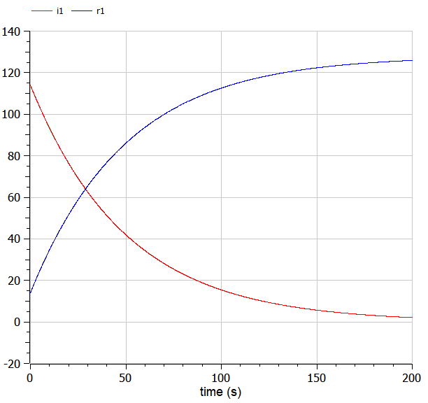
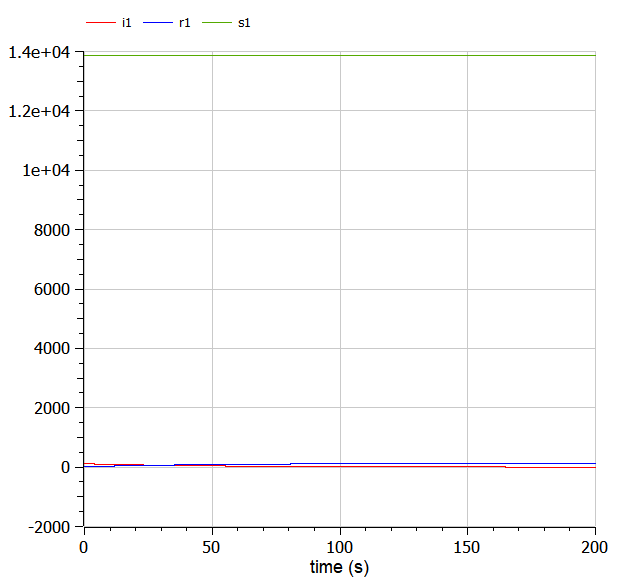
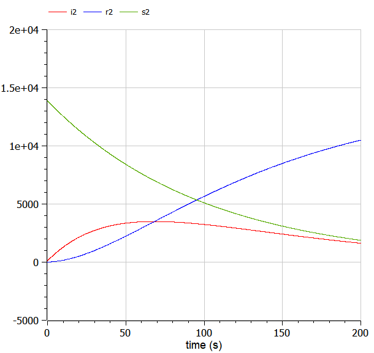

---
# Front matter
lang: ru-RU
title: Защита лабораторной работы №6. Задача об эпидемии
author: "Исаханян Эдуард Тигранович"
group: NFIbd-01-19
institute: RUDN University, Moscow, Russian Federation
date: 2022 Feb 26th

# Formatting
toc: false
slide_level: 2
theme: metropolis
header-includes:
  - \metroset{progressbar=frametitle,sectionpage=progressbar,numbering=fraction}
  - '\makeatletter'
  - '\beamer@ignorenonframefalse'
  - '\makeatother' 
aspectratio: 43 
section-titles: true
---

# Защита лабораторной работы  

# Цель

Цель данной лабораторной работы научиться решать задачу об эпидемии.  

# Задачи  

1. Рассмотреть простейшую модель эпидемии;
2. Построить графики изменения числа особей в каждой из трех групп;
3. Рассмотреть, как будет протекать эпидемия.

# Уравнения  

$$ \frac{dS}{dt} = \left\{ \begin{array}{c} - \alpha S, если I(t)>I^* \ 0, если I(t) \leq I^* \end{array} \right.$$  
$$ \frac{dI}{dt} = \left\{ \begin{array}{c} - \alpha S - \beta I, если I(t)>I^* \ - \beta I, если I(t) \leq I^* \end{array} \right.$$  
$$ \frac{dR}{dt} = \beta I$$  

# Результат выполнения

  

# Результат выполнения

  

# Результат выполнения

# Вывод  

В ходе работы, мы построили графики изменения числа особей в каждой из трех групп, также рассмотрели, как будет протекать эпидемия в разных случаях.  
