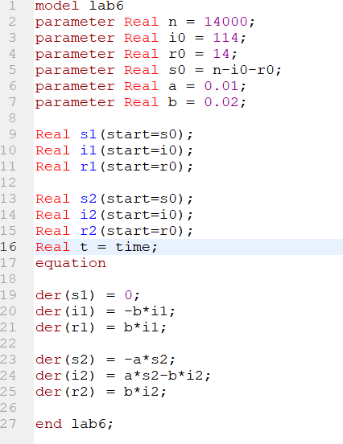
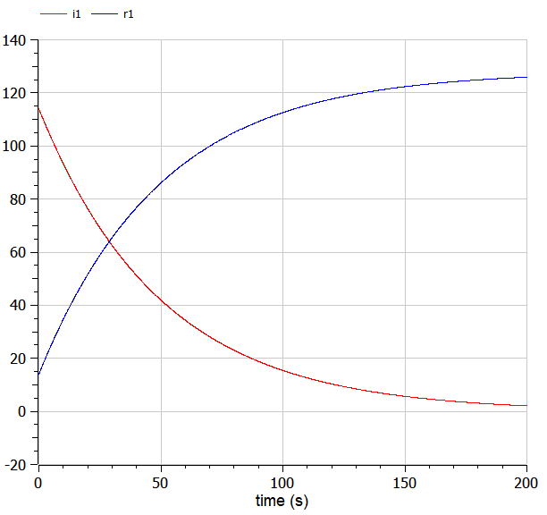
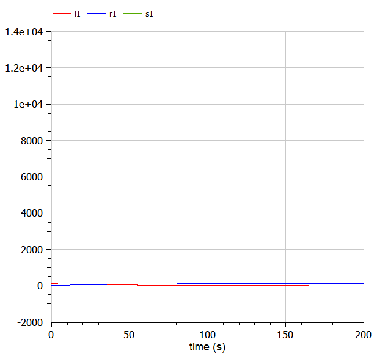
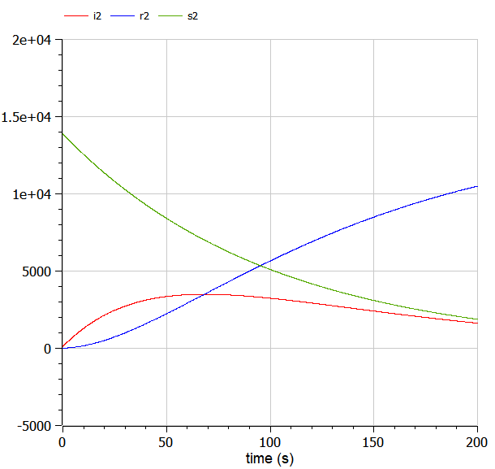

---
# Front matter
title: "Отчет по лабораторной работе №6"
subtitle: "Задача об эпидемии"
author: "Исаханян Эдуард Тигранович"
group: NFIbd-01-19
institute: RUDN University, Moscow, Russian Federation
date: 2022 Feb 26th

# Generic otions
lang: ru-RU
toc-title: "Содержание"

# Bibliography
bibliography: bib/cite.bib
csl: pandoc/csl/gost-r-7-0-5-2008-numeric.csl

# Pdf output format
toc: true # Table of contents
toc_depth: 2
lof: true # List of figures
lot: true # List of tables
fontsize: 12pt
linestretch: 1.5
papersize: a4
documentclass: scrreprt
### Fonts
mainfont: PT Serif
romanfont: PT Serif
sansfont: PT Sans
monofont: PT Mono
mainfontoptions: Ligatures=TeX
romanfontoptions: Ligatures=TeX
sansfontoptions: Ligatures=TeX,Scale=MatchLowercase
monofontoptions: Scale=MatchLowercase,Scale=0.9
## Biblatex
biblatex: true
biblio-style: "gost-numeric"
biblatexoptions:
- parentracker=true
- backend=biber
- hyperref=auto
- language=auto
- autolang=other*
- citestyle=gost-numeric
## Misc options
indent: true
header-includes:
- \linepenalty=10 # the penalty added to the badness of each line within a paragraph (no associated penalty node) Increasing the value makes tex try to have fewer lines in the paragraph.
- \interlinepenalty=0 # value of the penalty (node) added after each line of a paragraph.
- \hyphenpenalty=50 # the penalty for line breaking at an automatically inserted hyphen
- \exhyphenpenalty=50 # the penalty for line breaking at an explicit hyphen
- \binoppenalty=700 # the penalty for breaking a line at a binary operator
- \relpenalty=500 # the penalty for breaking a line at a relation
- \clubpenalty=150 # extra penalty for breaking after first line of a paragraph
- \widowpenalty=150 # extra penalty for breaking before last line of a paragraph
- \displaywidowpenalty=50 # extra penalty for breaking before last line before a display math
- \brokenpenalty=100 # extra penalty for page breaking after a hyphenated line
- \predisplaypenalty=10000 # penalty for breaking before a display
- \postdisplaypenalty=0 # penalty for breaking after a display
- \floatingpenalty = 20000 # penalty for splitting an insertion (can only be split footnote in standard LaTeX)
- \raggedbottom # or \flushbottom
- \usepackage{float} # keep figures where there are in the text
- \floatplacement{figure}{H} # keep figures where there are in the text
---

# Цель работы  

Цель данной лабораторной работы научиться решать задачу об эпидемии.  

# Задание  

1. Рассмотреть простейшую модель эпидемии;  
2. Построить графики изменения числа особей в каждой из трех групп;  
3. Рассмотреть, как будет протекать эпидемия.  

# Теоретическое введение  

Рассмотрим простейшую модель эпидемии. Предположим, что некая популяция, состоящая из N особей, (считаем, что популяция изолирована) подразделяется на три группы. Первая группа - $S(t)$ — восприимчивые к болезни, но пока здоровые особи. Вторая - $I(t)$ — это число инфицированных особей, которые также при этом являются распространителями инфекции. И третья - $R(t)$ — это здоровые особи с иммунитетом к болезни.

До того, как число заболевших не превышает критического значения $I^*$ считаем, что все больные изолированы и не заражают здоровых. Когда $I(t)>I^*$, тогда инфицирование способны заражать восприимчивых к болезни особей.

Таким образом, скорость изменения числа S(t) меняется по следующему закону:

$$ \frac{dS}{dt} = \left\{ \begin{array}{c} - \alpha S, если I(t)>I^* \\ 0, если I(t) \leq I^* \end{array} \right.$$

Поскольку каждая восприимчивая к болезни особь, которая, в конце концов, заболевает, сама становится инфекционной, то скорость изменения числа инфекционных особей представляет разность за единицу времени между заразившимися и теми, кто уже болеет и лечится, т.е.:

$$ \frac{dI}{dt} = \left\{ \begin{array}{c} - \alpha S - \beta I, если I(t)>I^* \\ - \beta I, если I(t) \leq I^* \end{array} \right.$$

А скорость изменения выздоравливающих особей (при этом приобретающие иммунитет к болезни)

$$ \frac{dR}{dt} = \beta I$$

Постоянные пропорциональности:

$\alpha$ — коэффициент заболеваемости

$\beta$ — коэффициент выздоровления

Для анализа картины протекания эпидемии необходимо рассмотреть два случая: $I(0) \leq I^*$ и $I(0) > I^*$

# Выполнение лабораторной работы  

1. Напишем код для решения задачи о эпидемии.  
   { #fig:001 width=70% }  
2. График первого случая.  
   { #fig:002 width=70% }  
   { #fig:003 width=70% }  
3. График второго случая.  
   { #fig:004 width=70% }  

# Выводы  

В ходе работы, мы построили графики изменения числа особей в каждой из трех групп, также рассмотрели, как будет протекать эпидемия в разных случаях.  

# Список литературы{.unnumbered}  
1. Методические материалы к лабораторной работе, представленные на сайте "ТУИС РУДН" https://esystem.rudn.ru/  
   ::: {#refs}
   :::