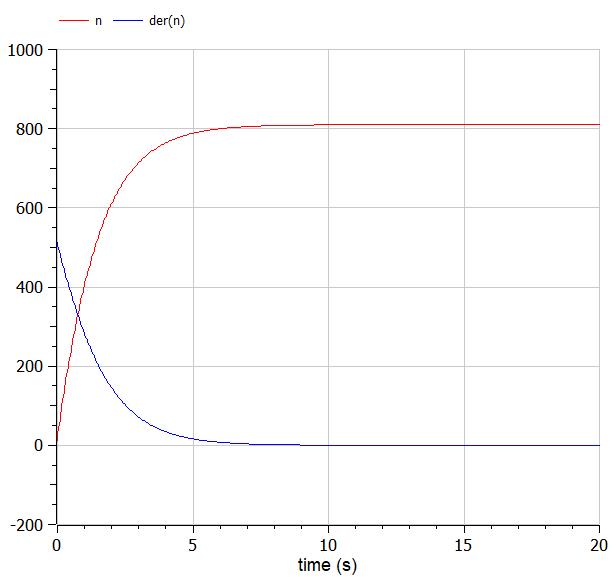
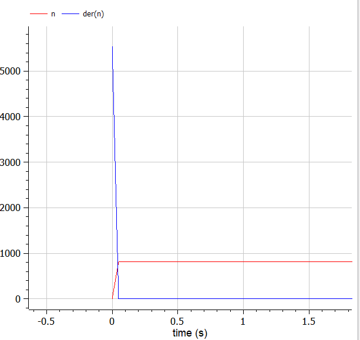
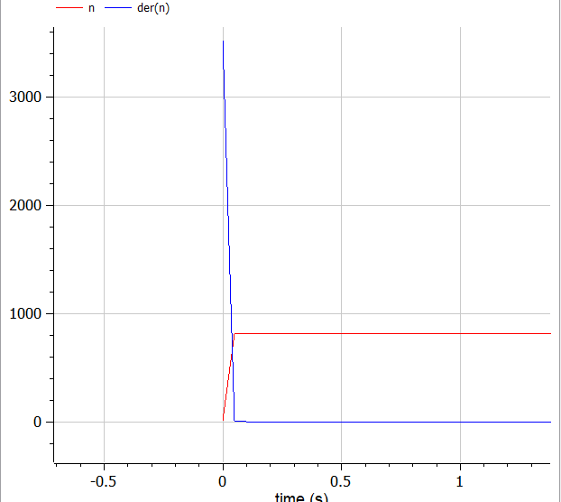

---
# Front matter
lang: ru-RU
title: Защита лабораторной работы №7. Эффективность рекламы
author: "Исаханян Эдуард Тигранович"
group: NFIbd-01-19
institute: RUDN University, Moscow, Russian Federation
date: 2022 March 26th

# Formatting
toc: false
slide_level: 2
theme: metropolis
header-includes:
   - \metroset{progressbar=frametitle,sectionpage=progressbar,numbering=fraction}
   - '\makeatletter'
   - '\beamer@ignorenonframefalse'
   - '\makeatother' 
aspectratio: 43 
section-titles: true
---

# Защита лабораторной работы

# Цель

Цель данной лабораторной работы рассмотреть модель эффективности рекламы в разных случаях.

# Задачи

1. Построить график распространения рекламы о салоне красоты;
2. Сравнить эффективность рекламной кампании;
3. Определить в какой момент времени эффективность рекламы будет иметь
   максимально быстрый рост;
4. Построить решение, если учитывать вклад только платной рекламы;
5. Построить решение, если предположить, что информация о товаре
   распространятся только путем «сарафанного радио», сравнить оба решения.

# Условния

Постройте график распространения рекламы, математическая модель которой описывается следующим уравнением:

$\frac{dn}{dt} = (0.64 + 0.00014n(t))(N - n(t))$
$\frac{dn}{dt} = (0.000014 + 0.63n(t))(N - n(t))$
$\frac{dn}{dt} = (0.7t + 0.4cos(t)n(t))(N - n(t))$
При этом объем аудитории $N$ = 810, в начальный момент о товаре знает 11 человек. Для случая 2 определите в какой момент времени скорость распространения рекламы будет иметь максимальное значение.

# Уравнения

Математическая модель распространения рекламы описывается уравнением:

$$\frac{dn}{dt} = (\alpha_1(t) + \alpha_2(t)n(t))(N - n(t))$$

# Результут
График 1 случая:(рис. [-@fig:001])

{ #fig:001 width=70% }

## Результут
График 2 случая:(рис. [-@fig:002])

{ #fig:002 width=70% }

## Результут
График 3 случая:(рис. [-@fig:003])

{ #fig:003 width=70% }

# Вывод

- Познакомился с моделью Мальтуса, а также с уравнением логистической кривой;
- Рассмотрел модель эффективности рекламы в разных случаях, а также построил график распространения рекламы.
 
