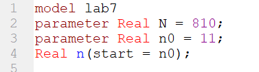
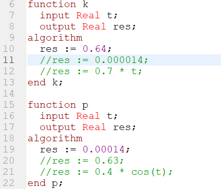
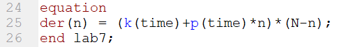
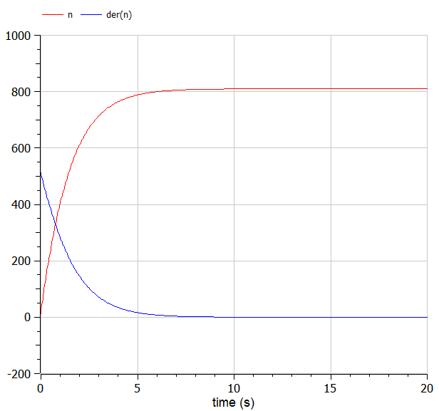
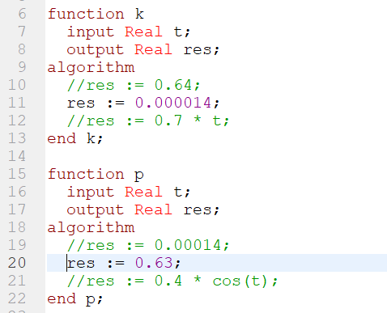
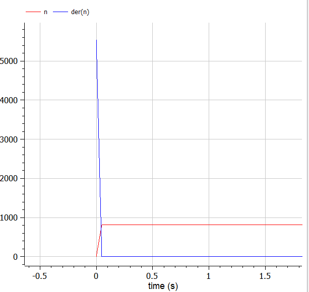
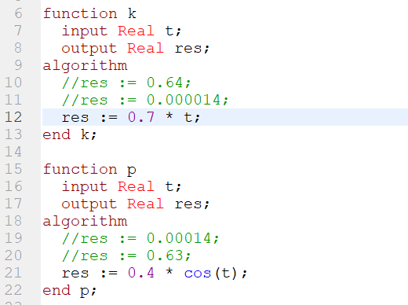
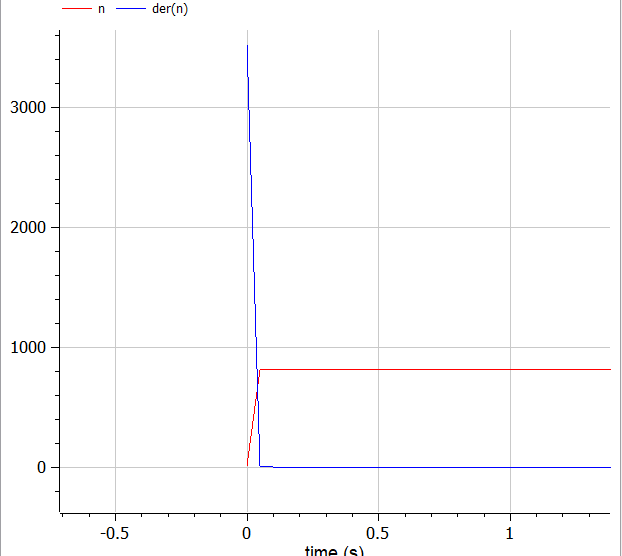

---
# Front matter
title: "Лабораторная работа №7"
subtitle: "Эффективность рекламы"
author: "Исаханян Эдуард Тигранович"
group: NFIbd-01-19
institute: RUDN University, Moscow, Russian Federation
date: 2022 March 26th

# Generic otions
lang: ru-RU
toc-title: "Содержание"

# Bibliography
bibliography: bib/cite.bib
csl: pandoc/csl/gost-r-7-0-5-2008-numeric.csl

# Pdf output format
toc: true # Table of contents
toc_depth: 2
lof: true # List of figures
lot: true # List of tables
fontsize: 12pt
linestretch: 1.5
papersize: a4
documentclass: scrreprt
### Fonts
mainfont: PT Serif
romanfont: PT Serif
sansfont: PT Sans
monofont: PT Mono
mainfontoptions: Ligatures=TeX
romanfontoptions: Ligatures=TeX
sansfontoptions: Ligatures=TeX,Scale=MatchLowercase
monofontoptions: Scale=MatchLowercase,Scale=0.9
## Biblatex
biblatex: true
biblio-style: "gost-numeric"
biblatexoptions:
- parentracker=true
- backend=biber
- hyperref=auto
- language=auto
- autolang=other*
- citestyle=gost-numeric
## Misc options
indent: true
header-includes:
- \linepenalty=10 # the penalty added to the badness of each line within a paragraph (no associated penalty node) Increasing the value makes tex try to have fewer lines in the paragraph.
- \interlinepenalty=0 # value of the penalty (node) added after each line of a paragraph.
- \hyphenpenalty=50 # the penalty for line breaking at an automatically inserted hyphen
- \exhyphenpenalty=50 # the penalty for line breaking at an explicit hyphen
- \binoppenalty=700 # the penalty for breaking a line at a binary operator
- \relpenalty=500 # the penalty for breaking a line at a relation
- \clubpenalty=150 # extra penalty for breaking after first line of a paragraph
- \widowpenalty=150 # extra penalty for breaking before last line of a paragraph
- \displaywidowpenalty=50 # extra penalty for breaking before last line before a display math
- \brokenpenalty=100 # extra penalty for page breaking after a hyphenated line
- \predisplaypenalty=10000 # penalty for breaking before a display
- \postdisplaypenalty=0 # penalty for breaking after a display
- \floatingpenalty = 20000 # penalty for splitting an insertion (can only be split footnote in standard LaTeX)
- \raggedbottom # or \flushbottom
- \usepackage{float} # keep figures where there are in the text
- \floatplacement{figure}{H} # keep figures where there are in the text
---

# Цель работы
Цель данной лабораторной работы изучить модель эффективности рекламы.

# Задание
1. Построить график распространения рекламы о салоне красоты;
2. Сравнить эффективность рекламной кампании;
3. Определить в какой момент времени эффективность рекламы будет иметь
   максимально быстрый рост;
4. Построить решение, если учитывать вклад только платной рекламы;
5. Построить решение, если предположить, что информация о товаре
   распространятся только путем «сарафанного радио», сравнить оба решения.

## Теоретическое введение

Организуется рекламная кампания нового товара или услуги. Необходимо, чтобы прибыль будущих продаж с избытком покрывала издержки на рекламу. Вначале расходы могут превышать прибыль, поскольку лишь малая часть потенциальных покупателей будет информирована о новинке. Затем, при увеличении числа продаж, возрастает и прибыль, и, наконец, наступит момент, когда рынок насытится, и рекламировать товар станет бесполезным.

Предположим, что торговыми учреждениями реализуется некоторая продукция, о которой в момент времени $t$ из числа потенциальных покупателей $N$ знает лишь $n$ покупателей. Для ускорения сбыта продукции запускается реклама по радио, телевидению и других средств массовой информации. После запуска рекламной кампании информация о продукции начнет распространяться среди потенциальных покупателей путем общения друг с другом. Таким образом, после запуска рекламных объявлений скорость изменения числа знающих о продукции людей пропорциональна как числу знающих о товаре покупателей, так и числу покупателей о нем не знающих.

Модель рекламной кампании описывается следующими величинами. Считаем, что

$\frac{dn}{dt}$ — скорость изменения со временем числа потребителей, узнавших о товаре и готовых его купить;

$t$ — время, прошедшее с начала рекламной кампании;

$n(t)$ — число уже информированных клиентов. Эта величина пропорциональна числу покупателей, еще не знающих о нем. Это описывается следующим образом:

$$\alpha_1(t)(N-n(t))$$

$N$ — общее число потенциальных платежеспособных покупателей

$\alpha_1(t)>0$ — характеризует интенсивность рекламной кампании (зависит от затрат на рекламу в данный момент времени).

Помимо этого, узнавшие о товаре потребители также распространяют полученную информацию среди потенциальных покупателей, не знающих о нем (в этом случае работает т.н. сарафанное радио). Этот вклад в рекламу описывается величиной

$$\alpha_2(t)n(t)(N-n(t))$$

эта величина увеличивается с увеличением потребителей узнавших о товаре.

Математическая модель распространения рекламы описывается уравнением:

$$\frac{dn}{dt} = (\alpha_1(t) + \alpha_2(t)n(t))(N - n(t))$$[^1]

# Выполнение лабораторной работы
1. Записываем начальные условия: $n_0 =11$ - количество людей, знающих о товаре в начальный момент времени, $N = 810$ - максимальное количество людей, которых может заинтересовать товар.(рис. [-@fig:001])

{ #fig:001 width=70% }

2. Далее прописываем две функции K и P для дольнейших вычислений.(рис. [-@fig:002])

{ #fig:002 width=70% }

3. Записсываем дифференциальное уравнение:(рис. [-@fig:003])

{ #fig:003 width=70% }

4. Далее строим график распространения рекламы:(рис. [-@fig:004])

{ #fig:004 width=70% }

Далее делаем то же самое для 2 и 3 случая, только меняем коэффиценты в функциях.  
5. Код второго случая:(рис. [-@fig:005])  

    { #fig:005 width=70% }  

6. График 2 случая:(рис. [-@fig:006])  

    { #fig:006 width=70% }  

7. Код третьего случая:(рис. [-@fig:007])  

    { #fig:007 width=70% }  

8. График 3 случая:(рис. [-@fig:008])  

    { #fig:008 width=70% }  

9. Также нам необходимо определить максимальное значение скорости распространения рекламы во 2 случае.(рис. [-@fig:009])  

    { #fig:009 width=70% }  
      
    По графику видно, что значение графика производной максимально в начальный момент времени t0 = 0.

# Ответы на вопросы

### Записать модель Мальтуса (дать пояснение, где используется данная модель)

Демографическая модель  
Скорость роста пропорциональна текущему размеру популяции
$$ \frac{\partial x}{\partial t} = {\alpha}x $$

где $x$ — исходная численность населения, ${\alpha}$ — некоторый параметр, определяемый разностью между рождаемостью и смертностью. $t$ — время.

### Записать уравнение логистической кривой (дать пояснение, что описывает данное уравнение)

$$ \frac{\partial x}{\partial t} = {\alpha}(1 - \frac{x}{x_s})x $$

где ${x_s}$ - «равновесный» размер популяции, при котором рождаемость в точности компенсируется смертностью. Размер популяции в такой модели стремится к равновесному значению ${x_s}$, причем такое поведение структурно устойчиво.  
Данное уравнение описывает рождаемость и смертность с учетом роста численности.

### На что влияет коэффициент $\alpha_1(t)$ и $\alpha_2(t)$ в модели распространения рекламы

$\alpha_1(t)$ — интенсивность рекламной кампании, зависящая от затрат

$\alpha_2(t)$ — интенсивность рекламной кампании, зависящая от сарафанного радио.

###  Как ведет себя рассматриваемая модель при $\alpha_1(t) \gg \alpha_2(t)$

При $\alpha_1(t) \gg \alpha_2(t)$ получается модель типа модели Мальтуса.

$$ \frac{\partial x}{\partial t} = {\alpha}x $$

### Как ведет себя рассматриваемая модель при $\alpha_1(t) \ll \alpha_2(t)$

При $\alpha_1(t) \ll \alpha_2(t)$ получаем уравнение логистической кривой:

$$ \frac{\partial x}{\partial t} = {\alpha}(1 - \frac{x}{x_s})x $$

# Выводы

В ходе работы, мы научились строить эффективности рекламы, а также вычислили и сравнили эффективность рекламы для трех случаев.

# Список литературы{.unnumbered}

1. Методические материалы к лабораторной работе, представленные на сайте "ТУИС РУДН" https://esystem.rudn.ru/  
   ::: {#refs}
   :::

[^1]: Методические материалы к лабораторной работе