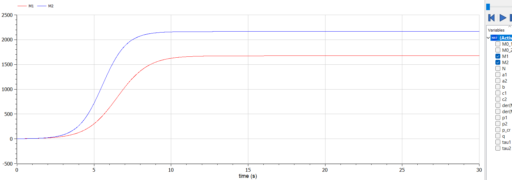
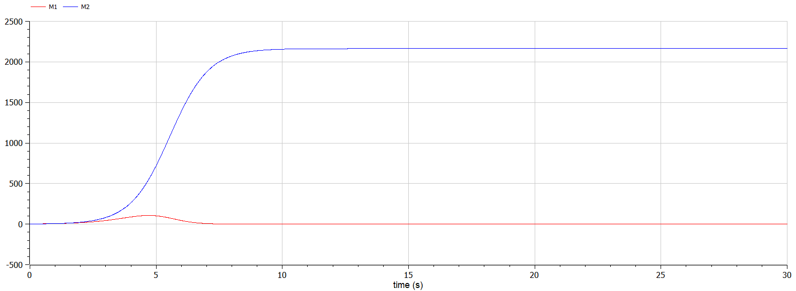

---
# Front matter
lang: ru-RU
title: Защита лабораторной работы №8. Модель конкуренции двух фирм
author: "Исаханян Эдуард Тигранович"
group: NFIbd-01-19
institute: RUDN University, Moscow, Russian Federation
date: 2022 April 2

# Formatting
toc: false
slide_level: 2
theme: metropolis
header-includes:
  - \metroset{progressbar=frametitle,sectionpage=progressbar,numbering=fraction}
  - '\makeatletter'
  - '\beamer@ignorenonframefalse'
  - '\makeatother' 
aspectratio: 43 
section-titles: true
---

# Защита лабораторной работы  

# Цель

Цель данной лабораторной работы научиться строить модель конкуренции двух фирм для двух случаев без учета социально-психологического фактора и с учетом социально-психологического фактора.  

# Задачи

1. Построить графики изменения оборотных средств фирмы 1 и фирмы 2 без учета постоянных издержек и с веденной нормировкой для случая 1.
2. Построить графики изменения оборотных средств фирмы 1 и фирмы 2 без
   учета постоянных издержек и с веденной нормировкой для случая 2.
 

# Уравнения  

$$\frac{dM_1}{d\theta} = M_1 - \frac{b}{c_1} M_1 M_2 - \frac{a_1}{c_1} M_1^2$$

$$\frac{dM_2}{d\theta} = \frac{c_2}{c_1} M_2 - \frac{b}{c_1} M_1 M_2-\frac{a_2}{c_1} M_2^2$$

# Результат выполнения

{ #fig:001 width=70% }

# Результат выполнения

{ #fig:002 width=70% }  

# Вывод  

В ходе работы, мы научились строить модель конкуренции двух фирм для двух случаев без учета социально-психологического фактора и с учетом социально-психологического фактора, также построили эти графики.  

 
