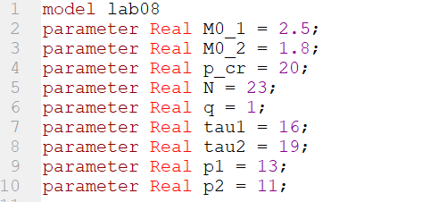
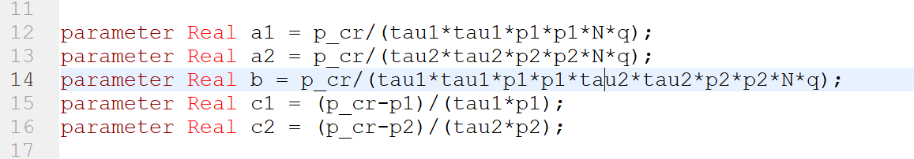
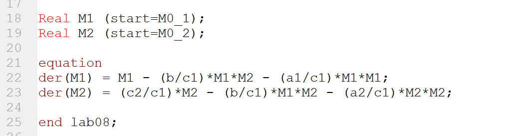
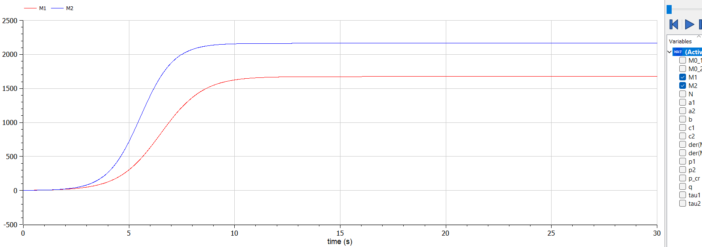
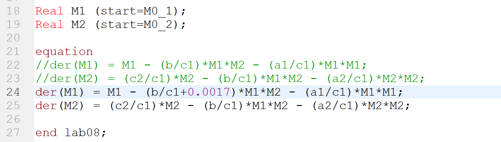
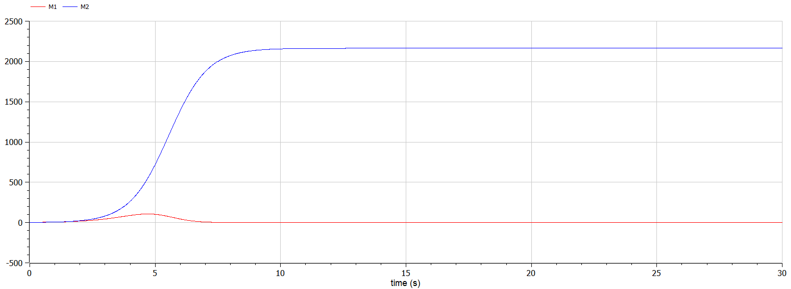

---
# Front matter
title: "Лабораторная работа №8"
subtitle: "Модель конкуренции двух фирм"
author: "Исаханян Эдуард Тигранович"
group: NFIbd-01-19
institute: RUDN University, Moscow, Russian Federation
date: 2022 April 2

# Generic otions
lang: ru-RU
toc-title: "Содержание"

# Bibliography
bibliography: bib/cite.bib
csl: pandoc/csl/gost-r-7-0-5-2008-numeric.csl

# Pdf output format
toc: true # Table of contents
toc_depth: 2
lof: true # List of figures
lot: true # List of tables
fontsize: 12pt
linestretch: 1.5
papersize: a4
documentclass: scrreprt
## I18n
polyglossia-lang:
  name: russian
  options:
	- spelling=modern
	- babelshorthands=true
polyglossia-otherlangs:
  name: english
### Fonts
mainfont: PT Serif
romanfont: PT Serif
sansfont: PT Sans
monofont: PT Mono
mainfontoptions: Ligatures=TeX
romanfontoptions: Ligatures=TeX
sansfontoptions: Ligatures=TeX,Scale=MatchLowercase
monofontoptions: Scale=MatchLowercase,Scale=0.9
## Biblatex
biblatex: true
biblio-style: "gost-numeric"
biblatexoptions:
  - parentracker=true
  - backend=biber
  - hyperref=auto
  - language=auto
  - autolang=other*
  - citestyle=gost-numeric
## Misc options
indent: true
header-includes:
  - \linepenalty=10 # the penalty added to the badness of each line within a paragraph (no associated penalty node) Increasing the value makes tex try to have fewer lines in the paragraph.
  - \interlinepenalty=0 # value of the penalty (node) added after each line of a paragraph.
  - \hyphenpenalty=50 # the penalty for line breaking at an automatically inserted hyphen
  - \exhyphenpenalty=50 # the penalty for line breaking at an explicit hyphen
  - \binoppenalty=700 # the penalty for breaking a line at a binary operator
  - \relpenalty=500 # the penalty for breaking a line at a relation
  - \clubpenalty=150 # extra penalty for breaking after first line of a paragraph
  - \widowpenalty=150 # extra penalty for breaking before last line of a paragraph
  - \displaywidowpenalty=50 # extra penalty for breaking before last line before a display math
  - \brokenpenalty=100 # extra penalty for page breaking after a hyphenated line
  - \predisplaypenalty=10000 # penalty for breaking before a display
  - \postdisplaypenalty=0 # penalty for breaking after a display
  - \floatingpenalty = 20000 # penalty for splitting an insertion (can only be split footnote in standard LaTeX)
  - \raggedbottom # or \flushbottom
  - \usepackage{float} # keep figures where there are in the text
  - \floatplacement{figure}{H} # keep figures where there are in the text
---

# Цель работы

Цель данной лабораторной работы научиться строить модель конкуренции двух фирм для двух случаев без учета социально-психологического фактора и с учетом социально-психологического фактора.  

# Задание

1. Построить графики изменения оборотных средств фирмы 1 и фирмы 2 без учета постоянных издержек и с веденной нормировкой для случая 1.  
2. Построить графики изменения оборотных средств фирмы 1 и фирмы 2 без
   учета постоянных издержек и с веденной нормировкой для случая 2.  

# Теоретическое введение  

Система уравнений для первого случая (без учета социально-психологического фактора)[^1]:  

$$\frac{dM_1}{d\theta} = M_1 - \frac{b}{c_1} M_1 M_2 - \frac{a_1}{c_1} M_1^2$$  

$$\frac{dM_2}{d\theta} = \frac{c_2}{c_1} M_2 - \frac{b}{c_1} M_1 M_2-\frac{a_2}{c_1} M_2^2$$  

где    
$$a_1 =\frac{p_cr}{\tau_1^2p_1^2Nq},$$  

$$a_2=\frac{p_cr}{\tau_2^2p_2^2Nq},$$  

$$b=\frac{p_cr}{\tau_1^2p_1^2\tau_2^2p_2^2Nq},$$  

$$c_1=\frac{p_cr - p_1}{\tau_1p_1},$$  

$$c_2=\frac{p_cr - p_2}{\tau_2p_2},$$  

$$t = c_1 \theta.$$  

### Обозначение  

- N – число потребителей производимого продукта;  
- $\tau$ – длительность производственного цикла;  
- p – рыночная цена товара;  
- p̃ – себестоимость продукта, то есть переменные издержки на производство единицы продукции;  
- q – максимальная потребность одного человека в продукте в единицу времени.  

# Выполнение лабораторной работы
1. Записываем начальные данные (рис. [-@fig:001]):  

   { #fig:001 width=70% }

2. Далее записываем параметры (рис. [-@fig:002]):

   { #fig:002 width=70% }

3. Записываем дифференциальное уравнение (рис. [-@fig:003]):

   { #fig:003 width=70% }

4. Построим графики изменения оборотных средств фирмы 1 и фирмы 2 для случая без учета социально-психологического фактора (рис. [-@fig:004]):

   { #fig:004 width=70% }

5. Далее изменяем наше дифференциальное уравнение (рис. [-@fig:005]):

   { #fig:005 width=70% }

6. Построим графики изменения оборотных средств фирмы 1 и фирмы 2 для случая с учетом социально-психологического фактора (рис. [-@fig:006]):

   { #fig:006 width=70% }

# Выводы  

В ходе работы, мы научились строить модель конкуренции двух фирм для двух случаев без учета социально-психологического фактора и с учетом социально-психологического фактора, также построили эти графики.  

# Список литературы{.unnumbered}  

1. Методические материалы к лабораторной работе, представленные на сайте "ТУИС РУДН" https://esystem.rudn.ru/    
   ::: {#refs}
   :::

[^1]: Методические материалы к лабораторной работе  